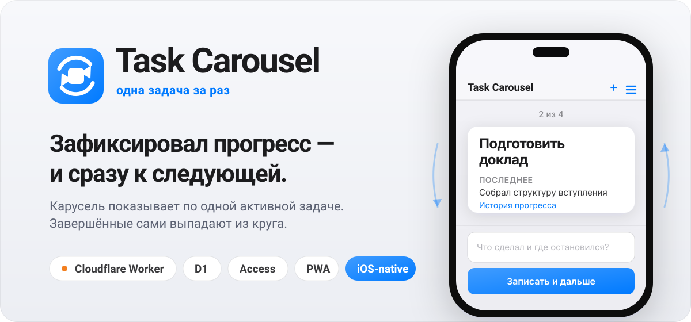

<div align="center">
  
</div>

<p align="center">
  
  
  
  
  
  
  
</p>

---

**Task Carousel** — мобильное веб-приложение для последовательной работы над несколькими
параллельными задачами. Вместо длинного списка, который давит и заставляет выбирать, —
одна активная задача на экране. Поработал, записал в поле **«Что сделал и где
остановился?»**, нажал **«Записать и дальше»** — открывается следующая. Круг цикличный;
завершённые задачи сами выпадают из карусели.

Продакшен: **[todo.azalio.net](https://todo.azalio.net)** (закрыт Cloudflare Access, вход по одноразовому коду на почту).

## Главный сценарий

1. Добавляешь несколько задач — каждая встаёт в конец карусели.
2. Открывается первая. Работаешь над ней.
3. В поле прогресса пишешь, что сделал и где остановился.
4. **«Записать и дальше»** — запись сохраняется, поле очищается, открывается следующая задача.
5. После последней снова первая. **«Готово»** убирает задачу из круга; **«Пропустить»** листает без записи.

Прогресс задачи — это **журнал текстовых записей** (не процент), с серверным временем.
Незаписанный черновик каждой задачи хранится локально и не теряется при переключении.

## Возможности

- **Карусель** со свайпами, стрелками (desktop) и клавиатурой (`←`/`→`, `Ctrl`/`Cmd`+`Enter`).
- **Экран всех задач** — вкладки «Активные» / «Выполненные», открыть · редактировать · вернуть в работу.
- **Завершение с отменой** — toast «Задача завершена» с кнопкой «Отменить» на 5 секунд.
- **История прогресса** по каждой задаче, новые записи сверху, с локальным временем.
- **PWA** — устанавливается на домашний экран, кэширует app shell, работает из кэша офлайн (запись блокируется, черновик сохраняется).
- **Нативный iOS-дизайн** (Apple HIG): SF-шрифт, system colors, автоматические light/dark, translucent-бары, grouped-карточки, тап-таргеты ≥ 44px.

## Установка на телефон

Task Carousel — PWA, поэтому его можно поставить на домашний экран через **Add to Home
Screen** и запускать как обычное приложение: в полноэкранном режиме, без адресной
строки, со своей иконкой.

- **iPhone / iPad (Safari):** открой [todo.azalio.net](https://todo.azalio.net) → кнопка **«Поделиться»** → **«На экран „Домой"»** (*Add to Home Screen*) → **«Добавить»**.
- **Android (Chrome):** открой сайт → меню **⋮** → **«Установить приложение»** (или **«Добавить на главный экран»**).

После этого иконка появляется на домашнем экране; сессия Cloudflare Access
запоминается, вводить одноразовый код при каждом запуске не нужно.

## Как устроено

Одно Cloudflare Workers-приложение раздаёт и API, и статику фронтенда.

| Слой | Технология | Роль |
|---|---|---|
| Frontend | React 19 · Vite · CSS variables | mobile-first SPA, карусель, PWA |
| Edge / API | Cloudflare Worker (Hono) | `/api/*`, раздача статики, security-заголовки (CSP, `nosniff`) |
| Данные | Cloudflare D1 (SQLite) | `users`, `tasks`, `progress_entries`, `user_carousel_state` |
| Авторизация | Cloudflare Access + `jose` | проверка подписи Access-JWT (`iss`/`aud`/`exp`/`nbf`); email — только из токена |

Всё за Cloudflare Access: приложение целиком закрыто, вход — по одноразовому коду на
разрешённую почту. Worker никогда не доверяет `email` из тела запроса и ходит в D1
только параметризованными запросами. Задачи пользователей изолированы по email.

## Стек

TypeScript · React 19 · Vite · `@cloudflare/vite-plugin` · Cloudflare Worker (Hono) ·
Cloudflare D1 · Cloudflare Access (`jose`) · PWA · Vitest · Playwright · pnpm.

## Разработка

Локально Access не поднять — есть dev-байпас авторизации (только для локали, в проде его нет).

```sh
pnpm install
cp .dev.vars.example .dev.vars     # DEV_AUTH_EMAIL выключает Access-проверку локально
pnpm exec wrangler d1 migrations apply task-carousel-db --local
pnpm dev
```

## Тесты

```sh
pnpm test        # Vitest: 113 unit/integration (логика карусели, валидация, API в miniflare D1)
pnpm test:e2e    # Playwright: 3 e2e основного сценария (сам поднимает preview на чистой БД)
pnpm typecheck   # tsc -b
```

## Деплой

Развернуть **свой отдельный инстанс** для другого человека (свой Worker, D1, домен и
Access) — пошаговый runbook в **[DEPLOY.md](DEPLOY.md)**. Коротко, для уже настроенного
проекта:

```sh
pnpm exec wrangler d1 migrations apply task-carousel-db --remote   # при новых миграциях
pnpm run deploy                                                    # именно `run` — не `pnpm deploy`
```

Worker `task-carousel` на домене `todo.azalio.net` (custom domain; `workers.dev` и preview
URLs выключены). Team-домен Access и AUD-тег приложения заданы в `wrangler.jsonc` (`vars`).

## Безопасность

- Проверка подписи Cloudflare Access JWT (`iss`, `aud`, `exp`, `nbf`) через JWKS team-домена.
- Email пользователя берётся **только** из проверенного токена, никогда из тела запроса.
- Только параметризованные D1-запросы; защита от cross-site мутаций (`Sec-Fetch-Site`/`Origin` + обязательный `application/json`).
- Content Security Policy (`script-src 'self'`), `X-Content-Type-Options: nosniff`, `no-store` на API. JWT и тексты прогресса не логируются.

## Структура репозитория

```text
worker/       — Cloudflare Worker: Hono-роуты, Access-auth, D1, логика карусели
src/          — React-фронтенд: экраны, компоненты, хуки, чистые хелперы
shared/       — общий контракт типов API (worker ⇄ frontend)
migrations/   — SQL-схема D1
tests/, e2e/  — Vitest и Playwright
docs/design.md — исходное техническое задание
DEPLOY.md     — как поднять отдельный инстанс
```
